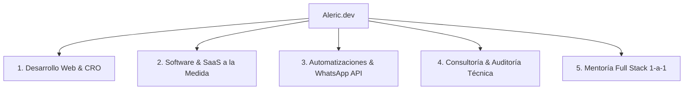
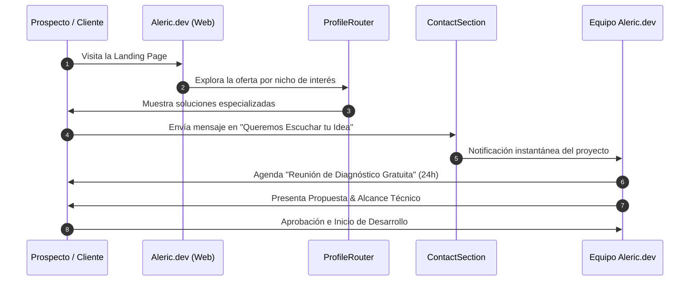

# 🚀 Aleric.dev — Documentación Técnica, Oferta Comercial y Blueprint de Negocio

Documento maestro con la especificación integral de servicios, propuesta de valor, flujo de operaciones y plan estratégico de crecimiento para **Aleric.dev**.

---

## 📌 1. Visión General & Posicionamiento de Marca

**Aleric.dev** opera como una boutique de ingeniería de software senior y consultoría tecnológica orientada al mercado hispanohablante. La propuesta de marca se fundamenta en eliminar la fricción técnica y ofrecer soluciones digitales de alto rendimiento con total transparencia.

### Pilares Fundamentales de Marca
- **🔑 Propiedad 100% del Cliente**: Código limpio, repositorios privados y transferencia total de propiedad sin licencias ocultas ni ataduras a plataformas propietarias.
- **💬 Ingeniería Senior Sin Intermediarios**: Comunicación directa en español entre el cliente y los desarrolladores a cargo.
- **🚀 Calidad & Rendimiento Extremo**: Sitios y aplicaciones web optimizadas para alcanzar **100/100 en Google Lighthouse**, garantizando tiempos de carga ultrarrápidos y mejor SEO.
- **🛡️ Arquitectura Escalable**: Construcción bajo buenas prácticas y patrones modernos que permiten el crecimiento continuo sin deuda técnica acelerada.

---

## 🛠️ 2. Desglose Detallado por Áreas de Especialidad



---

### 2.1. Desarrollo Web & Landings de Alta Conversión (CRO)
- **Ruta de la solución**: [`/desarrollo-web`](/desarrollo-web)
- **Público Objetivo**: Marcas, PyMEs, profesionales y empresas que requieren presencia web comercial competitiva.
- **Propuesta de Valor**: Creación de sitios web corporativos y páginas de aterrizaje diseñadas para convertir visitantes en clientes, impulsadas por un stack moderno ultrarrápido.
- **Diferenciador Clave**: Reemplazo de sitios pesados creados en WordPress por el *Aleric Web Stack* (Astro, Tailwind CSS, TypeScript, 0 bytes de JavaScript innecesario).
- **Entregables Principales**:
  - Landings de alta conversión optimizadas para campañas publicitarias (Google Ads, Meta Ads).
  - Portales corporativos multisección con integración de blogs y SEO técnico.
  - Tiendas E-commerce ligeras y escalables con pasarelas de pago (Stripe, Bold, Wompi, Mercado Pago).

---

### 2.2. Desarrollo de Software & SaaS a la Medida
- **Ruta de la solución**: [`/software-a-medida`](/software-a-medida)
- **Público Objetivo**: Startups, empresas en crecimiento y organizaciones que necesitan automatizar su lógica operativa única.
- **Propuesta de Valor**: Creación de plataformas web complejas, sistemas de gestión interna y aplicaciones SaaS multi-tenant adaptadas 100% a la medida.
- **Stack Técnico de Referencia**:
  - **Frontend**: React 19, Next.js (App Router), TypeScript, Tailwind CSS.
  - **Backend**: NestJS, Node.js, TypeScript, REST & GraphQL APIs.
  - **Bases de Datos & Caché**: PostgreSQL, Prisma ORM, Redis.
  - **Infraestructura**: Docker, AWS, Vercel, Supabase.
- **Ciclo de Vida del Software (4 Fases)**:
  1. *Fase 1: Diagnóstico de Arquitectura & Modelado de Datos*
  2. *Fase 2: Prototipado & MVP Funcional*
  3. *Fase 3: Desarrollo Incremental & Testing Automatizado*
  4. *Fase 4: Despliegue en la Nube & Monitoreo*

---

### 2.3. Automatización de Operaciones & WhatsApp Cloud API
- **Ruta de la solución**: [`/automatizaciones`](/automatizaciones)
- **Público Objetivo**: Equipos de ventas, atención al cliente y operaciones que pierden tiempo en tareas manuales repetitivas.
- **Propuesta de Valor**: Conexión e integración de sistemas internos para ofrecer respuestas automáticas 24/7 y agilizar el procesamiento de prospectos.
- **Diferenciador Clave**: Integración oficial de **WhatsApp Cloud API** con el orquestador de flujos de código abierto **n8n** y la plataforma multiagente **Chatwoot**.
- **Casos de Uso Recurrentes**:
  - Enrutamiento automático de leads capturados en landings hacia WhatsApp y CRM.
  - Notificaciones instantáneas de pedidos o citas confirmadas.
  - Sincronización bidireccional entre Google Sheets, Airtable, HubSpot y sistemas propios.

---

### 2.4. Consultoría & Auditoría Técnica Senior
- **Ruta de la solución**: [`/consultoria-tecnica`](/consultoria-tecnica)
- **Público Objetivo**: CTOs, Fundadores, Inversionistas y Líderes de Tecnología con plataformas existentes.
- **Propuesta de Valor**: Revisión independiente e imparcial del código fuente, infraestructura y arquitectura para identificar fallos, cuellos de botella e inseguridades.
- **4 Pilares de la Auditoría**:
  1. **Deuda Técnica & Calidad de Código**: Inspección de mantenibilidad y patrones de diseño.
  2. **Latencia & Rendimiento**: Optimización de consultas en base de datos y algoritmos lentos.
  3. **Seguridad & Estándares OWASP**: Identificación de vulnerabilidades e inyecciones.
  4. **Escalabilidad Cloud**: Evaluación de costos e infraestructura en AWS, GCP o Azure.

---

### 2.5. Mentoría & Capacitación Full Stack 1-a-1
- **Ruta de la solución**: [`/mentoria-fullstack`](/mentoria-fullstack)
- **Público Objetivo**: Desarrolladores software, freelancers y estudiantes avanzados que buscan acelerar su nivel técnico.
- **Propuesta de Valor**: Programa personalizado de entrenamiento práctico 1-a-1 enfocado en dominar las herramientas más demandadas del mercado tecnológico actual.
- **Temario de Maestría**:
  - TypeScript Avanzado & Clean Code.
  - Arquitectura Modular en Backend con NestJS.
  - React 19, Server Components & Hooks Avanzados.
  - Testing (Jest, Vitest), CI/CD & Despliegue Cloud.

---

## 🔄 3. Embudo de Conversión & Flujo del Negocio (Funnel Operations)

El flujo de ventas y atención en Aleric.dev está estructurado en 6 etapas secuenciales para garantizar alta conversión y excelente experiencia de usuario:



### Detalle de las Etapas del Embudo

1. **Atracción & Segmentación**:
   - El visitante llega a la página principal ([`index.astro`](/)) o a una landing de nicho específica.
   - El orquestador interactivo ([`ProfileRouter.tsx`](/src/components/ProfileRouter.tsx)) ayuda al usuario a identificarse con su categoría de solución exacta.
2. **Captura Humana & Cercana**:
   - Formulario empático (*"Queremos Escuchar tu Idea"*) en [`ContactSection.astro`](/src/components/ContactSection.astro).
   - Captura campos clave (Nombre, Correo, Teléfono/WhatsApp opcional, Servicio, Presupuesto estimado opcional y Detalle).
   - Alternativa directa de chat inmediato vía WhatsApp (~15 min de respuesta promedio).
3. **Reunión de Diagnóstico Gratuita (Discovery Call)**:
   - Sesión de 20 a 30 minutos donde un ingeniero de Aleric.dev analiza la factibilidad, requisitos y expectativas del cliente.
4. **Propuesta Comercial & Plan de Arquitectura**:
   - Presentación de alcance detallado, calendario de entregas por hitos y presupuesto claro.
5. **Desarrollo Ágil e Iterativo**:
   - Construcción transparente en repositorios privados con acceso directo para el cliente.
6. **Cierre, Transferencia & Soporte Continuo**:
   - Despliegue en producción y entrega 100% de repositorios y credenciales.
   - Período de acompañamiento y opción de plan de soporte técnico activo.

---

## 📈 4. Plan de Acción Recomendado para Escalar el Negocio al Máximo

Para acelerar el crecimiento de Aleric.dev y maximizar la atracción de clientes de alto valor, se recomiendan las siguientes acciones estratégicas:

### A. Estrategia de Contenidos e Inbound Marketing
- **Casos de Estudio Interactivos**: Publicar artículos mostrando comparativas del tipo *"Cómo reducimos el tiempo de carga de 6s a 0.8s en cliente X con Astro"*.
- **Plantillas Gratuitas de Automatización**: Compartir flujos de n8n para conectar WhatsApp Cloud API con Google Sheets o CRMs como imán de prospectos (Lead Magnet).

### B. SEO Técnico & Posicionamiento de Nicho
- Explotar los micro-schemas JSON-LD integrados en las 6 páginas estáticas.
- Crear artículos dedicados para palabras clave transaccionales como:
  - *"Desarrollo de SaaS con NestJS y React en LATAM"*
  - *"Automatización de WhatsApp API con n8n"*
  - *"Auditoría de código legacy Node.js"*

### C. Retención & Monetización Recurrente (MRR)
- **Mantenimiento & Evolución Cloud**: Ofrecer planes de retén mensual para actualizaciones de seguridad, soporte técnico e integración de nuevas funcionalidades en los sistemas SaaS desarrollados.
- **Auditorías Trimestrales**: Vender servicios de monitoreo de seguridad y rendimiento para clientes corporativos.

---

## 💻 5. Estructura del Proyecto Web

El sitio web está desarrollado sobre la última versión de **Astro**, utilizando componentes TypeScript y React para elementos dinámicos, y clases utilitarias de **Tailwind CSS** con sistema de tokens en color plano para temas claro y oscuro.

```text
web/
├── src/
│   ├── components/
│   │   ├── Navbar.astro             # Menú superior unificado
│   │   ├── CommercialHero.astro     # Héroe principal comercial
│   │   ├── ProfileRouter.tsx        # Selector interactivo de 6 soluciones
│   │   ├── MethodologySection.astro # Metodología en 4 pasos
│   │   ├── WhyUsSection.astro       # Pilares "Por qué elegirnos"
│   │   ├── TechStack.astro          # Stack & Puntuación 100/100 Lighthouse
│   │   ├── ContactSection.astro     # Formulario humano "Queremos Escuchar tu Idea"
│   │   ├── FloatingContactButton.astro # Botones flotantes circulares + tooltips
│   │   ├── Footer.astro             # Pie de página estructurado en 3 columnas
│   │   ├── WebComparison.astro      # Cuadro WordPress vs Aleric Stack
│   │   ├── SoftwareLifecycle.astro  # Roadmap de 4 fases de SaaS
│   │   ├── WhatsAppBenefits.astro   # Beneficios oficiales WhatsApp Cloud API
│   │   ├── AuditPillars.astro       # 4 pilares de auditoría técnica
│   │   └── MentorshipRoadmap.astro  # Syllabus de mentoría Full Stack
│   ├── pages/
│   │   ├── index.astro              # Página principal (Root)
│   │   ├── desarrollo-web/          # Nicho Desarrollo Web
│   │   ├── software-a-medida/       # Nicho Software & SaaS
│   │   ├── automatizaciones/        # Nicho Automatizaciones & WhatsApp
│   │   ├── consultoria-tecnica/     # Nicho Consultoría & Auditoría
│   │   └── mentoria-fullstack/      # Nicho Mentoría Full Stack
│   └── styles/
│       └── global.css               # Estilos globales y tokens CSS
└── README.md                        # Documento maestro del negocio
```

---
*© Aleric.dev — Todos los derechos reservados.*
